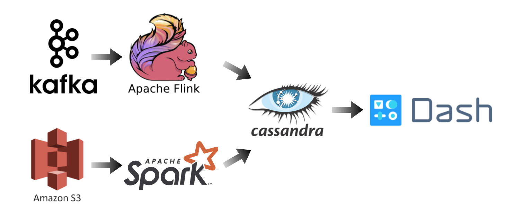

# INSIGHT-DE-Project

## Motivation
This program provides venue status and recommendation for user based on real-time check-in.

## Tech Stack

## Business Needs
Firstly, this program provides user the real-time list on Top Venue for different user groups (Streaming process):
  1. Tourist (compare with user table)
  2. Local (compare with user table)
  3. user's friends (compare with user friendship table)
  4. Current most crowd Venue (criteria on user stay time)
  
Secondly, this program also can recommend/not recommend a venue based on friend's ranking using friends relationship table (Batch process)

Thirdly, recommend venue to user for group (Batch process)

## Dataset:
FourSquare Check dataset
