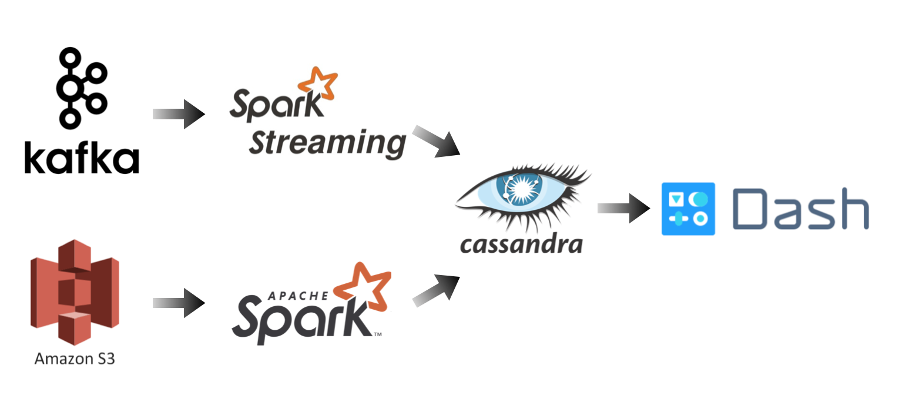

# INSIGHT-DE-Project

## Motivation
This program provides venue status and recommendation for user based on real-time check-in.

## Tech Stack

Batch Job: historical venues check in data are ingested from S3 bucket into Spark, which computes top-n pickup venues in different categories for everyone and your friends and saves the result into the cassadra. It is automated run with the airflow scheduler.

Streaming Job: real-time check in data are streamed by Kafka into Spark Streaming, where the stream check in data can be joined with the results of historical datta to provide the recommendations for the user.

## Business Needs
Firstly, this program provides user the real-time list on Top Venue for different user groups (Streaming process):
  1. Real time check in venues in group of local and non-local tourist (compare with user table) 
  2. user's friends favorite (compare with user friendship table)
  3. Current most crowd Venue (criteria on user stay time in a variable time window)
  
Secondly, this program also can recommend/not recommend a venue based on friend's ranking using friends relationship table (Batch process)

Thirdly, recommend venue to user for the friends (Batch process)

## Dataset:
FourSquare Check dataset
